# 主要技术栈

alibaba,cloud,springboot,最佳实践版本:https://github.com/alibaba/spring-cloud-alibaba/wiki/%E7%89%88%E6%9C%AC%E8%AF%B4%E6%98%8E

**核心依赖**

> Jdk: 17
>
> Maven: 3.8.7
>
> Nodejs: 10.24.1


| 依赖                 | 版本             |
| -------------------- |----------------|
| Spring Boot          | 3.0.3          |
| Spring Cloud         | 2022.0.1       |
| Spring Cloud Alibaba | 2022.0.0.0-RC1 |
| Mybatis Plus         | 3.5.3.1        |
| Spring Doc Open Api  | 2.0.2          |
| Behappy-Redis        | 3.0.3          |
| Behappy-Canal        | 3.0.2          |
| Wxpay-Sdk            | 0.0.3          |
| Hutool               | 5.8.11         |
| Xxl job              | 2.3.1          |
| Druid                | 1.2.15         |
| Spring Boot Admin    | 3.0.0          |

# TODO

- [x] swagger3 -> springDoc open api
- [x] sentinel业务整合
- [x] nacos配置中心整合
- [ ] seata业务整合 - 0%
- [ ] druid-springboot3 - 0%
- [x] 整合canal，保证数据库缓存一致性

# 环境搭建

首先我们需要一个能安装docker的环境，这里使用vagrant+virtualBox

vagrant下载地址：https://developer.hashicorp.com/vagrant/downloads

virtualBox下载地址：https://www.virtualbox.org/wiki/Downloads

## 将vagrant加入到系统环境变量中

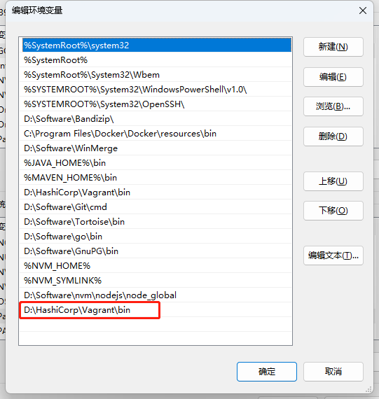

## 初始化Vagrantfile

- 以管理员身份执行CMD，切到vagrant安装目录的bin路径下
- 执行`vagrant init`，它会帮我生成`Vagrantfile`，如下

> D:\HashiCorp\Vagrant\bin>vagrant init

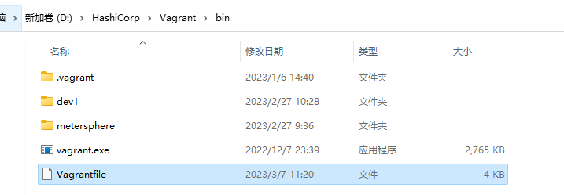

## 修改Vagrantfile并执行创建虚拟机命令

- 我们需要centos7版本的box，这里提供两种办法
    - 一种是直接在`vagrant up`的时候让服务自己去下载(此种办法可能会由于网络问题下载失败)
    - 或者通过此地址`https://app.vagrantup.com/centos/boxes/7/versions/2004.01/providers/virtualbox.box`，将box下载到本地，然后执行`vagrant box add --name centos/7 D:\HashiCorp\Vagrant\boxes\CentOS-7-x86_64-Vagrant-2004_01.VirtualBox.box`，再使用`vagrant box list`查看box列表是否存在，已存在则说明成功
- 修改Vagrantfile

```yaml
Vagrant.configure("2") do |config|
   (1..1).each do |i|
        config.vm.define "behappy#{i}" do |node|
            # 设置虚拟机的Box
            node.vm.box = "centos/7"
            # 设置虚拟机的主机名
            node.vm.hostname="behappy#{i}"
            # 设置虚拟机的IP，这里最终得到虚拟机的ip为192.168.56.100
            node.vm.network "private_network", ip: "192.168.56.#{99+i}", netmask: "255.255.255.0"
            # VirtaulBox相关配置
            node.vm.provider "virtualbox" do |v|
                # 设置虚拟机的名称
                v.name = "behappy#{i}"
                # 设置虚拟机的内存大小
                v.memory = 8192
                # 设置虚拟机的CPU个数
                v.cpus = 4
            end
        end
   end
end
```

- 启动虚拟机

执行`vagrant up`，等待启动完成

## 配置虚拟机ssh(远程登录)、网络、防火墙以及时间同步

- 执行`vagrant ssh`进入虚拟机
- 执行`sudo -s`切至root并修改ssh

```bash
vi /etc/ssh/sshd_config

修改以下属性为yes
PermitRootLogin yes 
PasswordAuthentication yes
```

- 修改完成后`:wq`保存，然后执行`service sshd restart`，重启ssh
- 最后执行`reboot`重启（我这里换成xshell登录）

* 关闭防火墙

```shell
systemctl stop firewalld
systemctl disable firewalld
```

* 关闭seLinux

```sh
# linux默认的安全策略
sed -i 's/enforcing/disabled/' /etc/selinux/config
setenforce 0
```

* 关闭swap

```shell
swapoff -a #临时关闭
sed -ri 's/.*swap.*/#&/' /etc/fstab #永久关闭
free -g #验证，swap必须为0
```

- **[centos 安装 ntpdate 并同步时间](https://www.cnblogs.com/xxoome/p/6125630.html)**

安装ntp

```
yum install -y ntp
```

与一个已知的时间服务器同步

```
# time.nist.gov 是一个时间服务器
ntpdate time.nist.gov 
```

删除本地时间并设置时区为上海

```
rm -rf /etc/localtime
ln -s /usr/share/zoneinfo/Asia/Shanghai /etc/localtime
```

## 安装git、docker、docker-compose并配置自启

```bash
yum install -y git
curl -fsSL https://get.docker.com | bash -s docker --mirror Aliyun
systemctl enable docker
systemctl start docker
curl -L https://github.com/docker/compose/releases/download/v2.16.0/docker-compose-linux-x86_64 -o /usr/local/bin/docker-compose && chmod +x /usr/local/bin/docker-compose
```

# 组件配置安装

- clone `behappy-docker-application` 项目

```bash
cd ~ && git clone https://github.com/behappy-hospital/behappy-docker-application
```

- 先创建mysql，并初始化一些表结构和数据

```bash
cd behappy-docker-application/ && docker-compose -f mysql/docker-compose.yml up -d

创建好mysql后，执行doc/05-sql以及doc/nacos下的sql文件： tables_xxl_job.sql-》yygh_manager.sql-》yygh初始化表结构.sql-》yygh初始化数据.sql-》nacos初始化表结构.sql-》nacos初始化数据.sql-》canal.sql
```

- 启动其他组件

```bash
docker-compose -f redis/docker-compose.yml up -d && docker-compose -f mongo/docker-compose.yml up -d && docker-compose -f rabbitmq/docker-compose.yaml up -d && docker-compose -f nacos/docker-compose.yml up -d && docker-compose -f sentinel/docker-compose.yml up -d && docker-compose -f xxl-job-admin/docker-compose.yml up -d && docker-compose -f canal/docker-compose.yml up -d
```

# Nacos配置 (数据我已添加完，下面是演示)

> 共享配置信息被我放在了`application-dev.yml`中，可以自行查看且修改

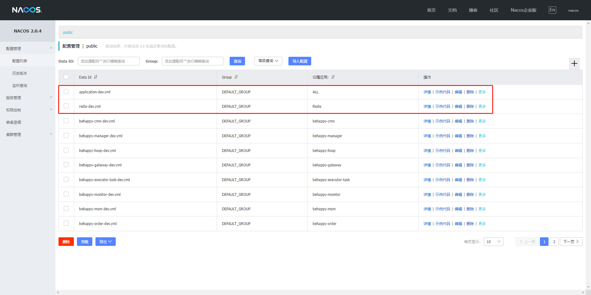
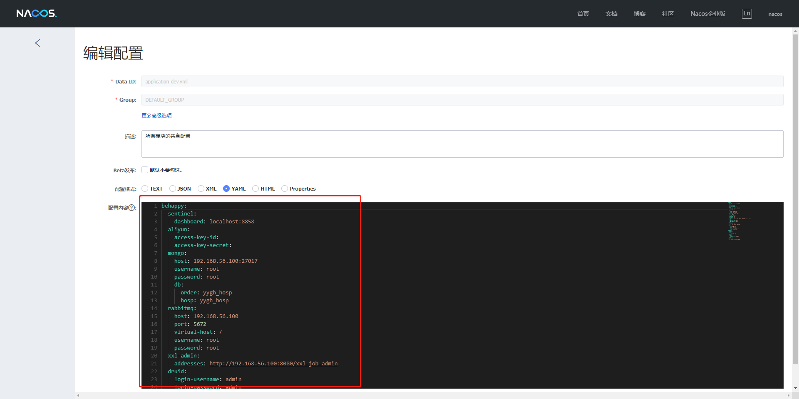

# Sentinel配置 (数据我已添加完，下面是演示)

当前配置了如下规则，可自行配置添加

1. 下订单和支付两个操作，一旦支付接口达到了阈值，那么需要优先保障支付操作， 那么订单接口就被限流，从而保护支付的目的

2. hospital服务设置统一限流

对于限流和降级，可以在gateway中配置，也可以在单一application中配置，异常统一配置在`org.xiaowu.behappy.common.sentinel.exception.SentinelExceptionHandler`
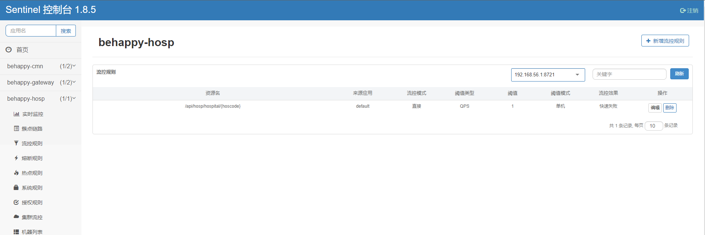 或
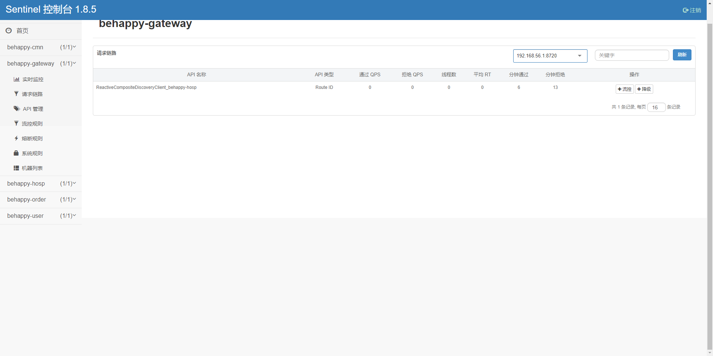
注：gateway中，每一个RouteDefinition都有id唯一标识，格式为ReactiveCompositeDiscoveryClient_{微服务名}，所以routeId配置成{微服务名}是不生效的

关于sentinel的详细教程可以参考：https://wang-xiaowu.github.io/posts/c7b26cd1/

# Canal配置 (数据我已添加完【rabbitMQ的配置部分需要自己完成】，下面是演示)

canal-client参考：https://github.com/behappy-project/behappy-canal
关于数据库缓存数据一致性问题参考：https://wang-xiaowu.github.io/posts/4deec345/#%E7%9B%91%E5%90%ACbinlog%EF%BC%8C%E8%BF%9B%E8%A1%8C%E5%88%A0%E9%99%A4%E7%BC%93%E5%AD%98%E6%93%8D%E4%BD%9C

> **当前项目已配置为rabbitMQ client接收方式(你可以选择使用任意一种接收方式，canal-server和canal-admin配置方式如下)**

### 修改serverMode为rabbitMQ, 配置基本信息

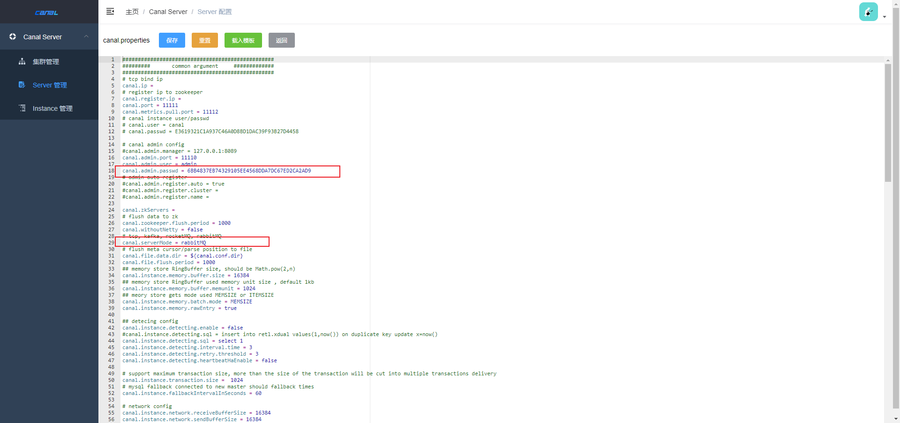

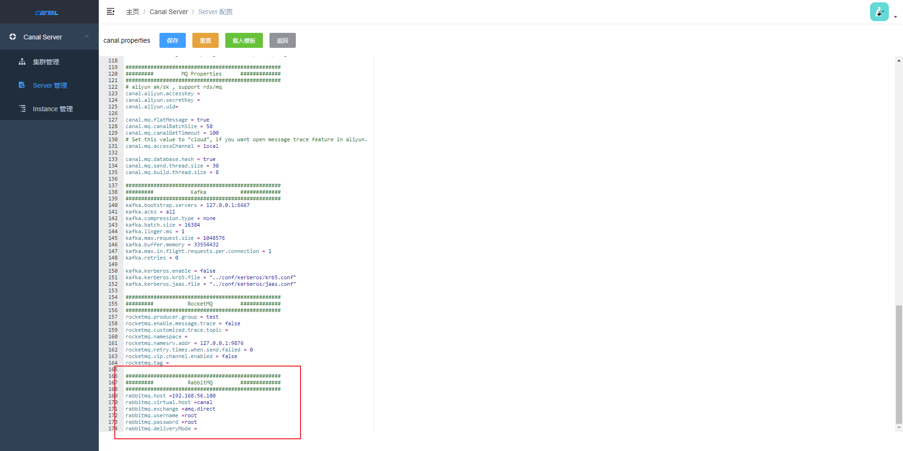

### 其次配置rabbitMQ，添加queue和exchange以及vhost等

> 创建一个vhost命名为`canal`
>
> 创建一个queue在`canal` 的vhost下
>
> 创建一个binding命名为`instance`绑定`amq.direct` exchange下的queue `instance`

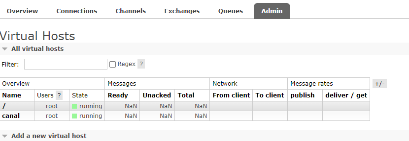

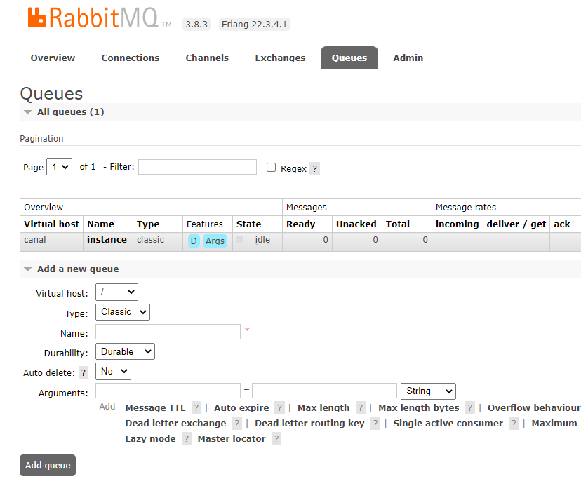

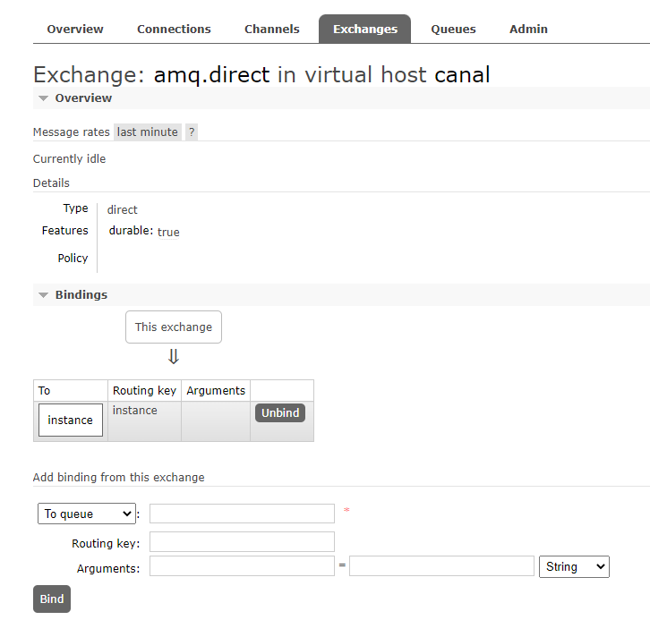

### 最后配置instance.properties(先点击新建instance -> 再载入模板 -> 命名为`instance `)

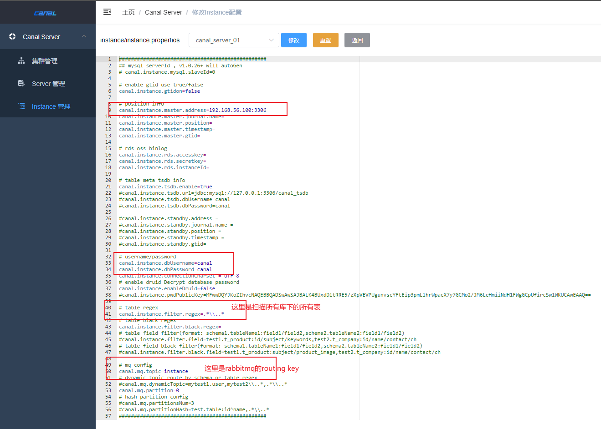

### 配置完查看`instance`和`server`的log是否启动成功

# 服务配置+启动

### 先后端项目

- 启动项目, 各模块作用已标明在下方
- 后端必须启动的模块

```
BehappyCmnApplication
BehappyGatewayApplication
BehappyHospApplication
BehappyManagerApplication
BehappyMsmApplication
BehappyOrderApplication
BehappyUserApplication
```

### 后前端项目

[behappy-hospital-admin](https://github.com/behappy-hospital/behappy-hospital-admin) -- 后台管理

[behappy-hospital-user](https://github.com/behappy-hospital/behappy-hospital-user) -- 平台页面

`git clone https://github.com/behappy-hospital/behappy-hospital-admin.git && git clone https://github.com/behappy-hospital/behappy-hospital-user.git`

> 下载依赖 && 启动(两个项目的下载依赖方式和启动方式都一样)
>
> npm install && npm run dev

# 系统操作流程

## 操作流程(项目启动成功后)

### 登陆manager服务, 设置医院信息

> 医院code：1000_0
>
> 签名key：880189488a80a9d7851d63240fd22aba
>
> 基础路径：http://localhost:8201

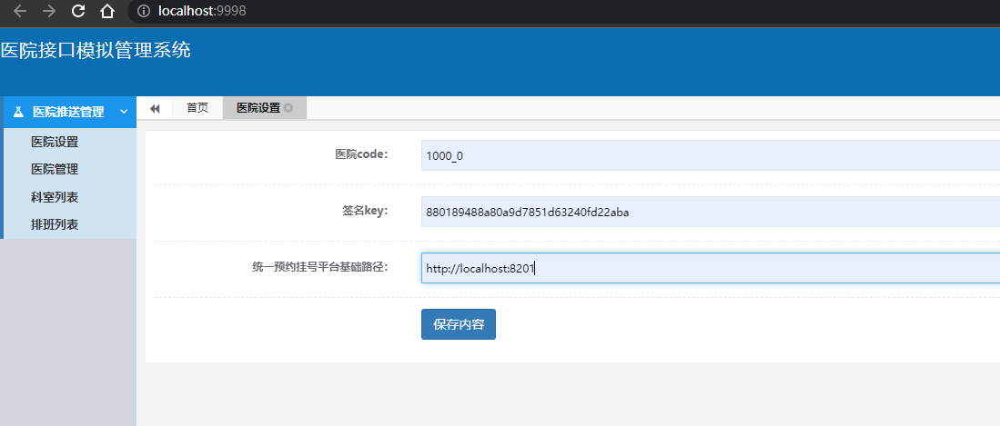

### 导入医院数据

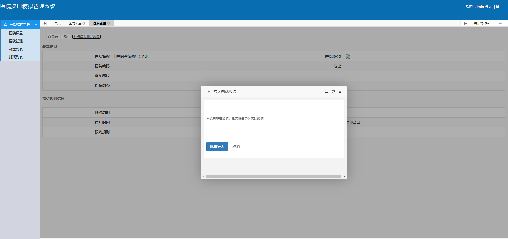

### 添加科室信息

> **找到behappy-manager/resources下的department.json, 复制粘贴-科室列表**

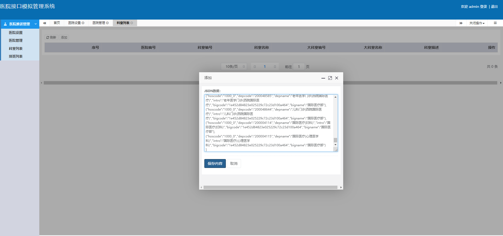

### 添加排班信息

> **找到behappy-manager/resources下的schedule.json, 复制粘贴-排班列表**

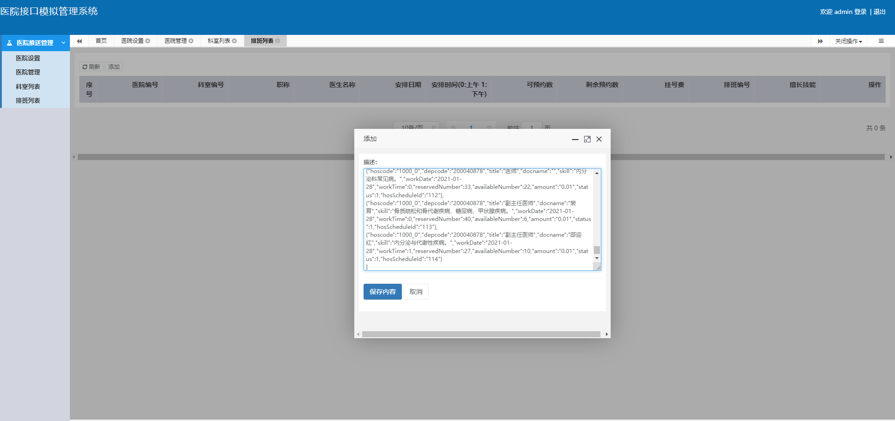

### 登陆behappy-hospital-user, 完成注册登陆

> **使用localhost访问,不要用ipv4,保证与微信回调地址一致**

#### 使用手机号或者微信登陆(目前是模拟发送短信, 在MsmService中可自行打开注释. 微信登陆使用谷粒学院的key和secret)

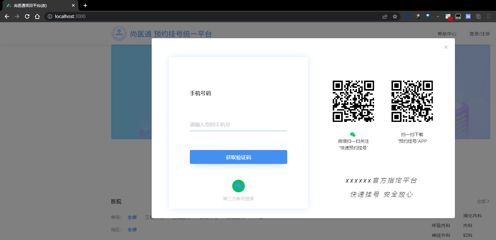

> **登陆后会回调到`myheader.vue的loginCallback方法中`, 如果openid为空则说明此用户为新用户, 需要绑定手机号. 接着打开手机登录层，绑定手机号**

#### 查看`behappy-msm`模块的日志, 能找到验证码

### 完成实名验证

#### 已取消了图片验证, 可以不传图片, 如果传图片, 记得将oss模块中的key和secret补全

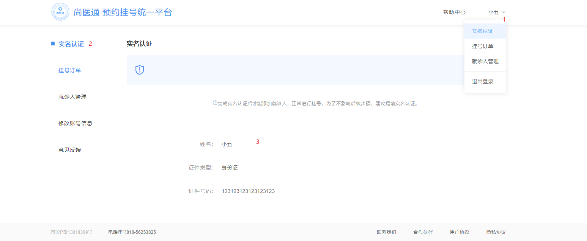

#### 登陆到admin, 通过认证


### 下单流程

#### 添加就诊人

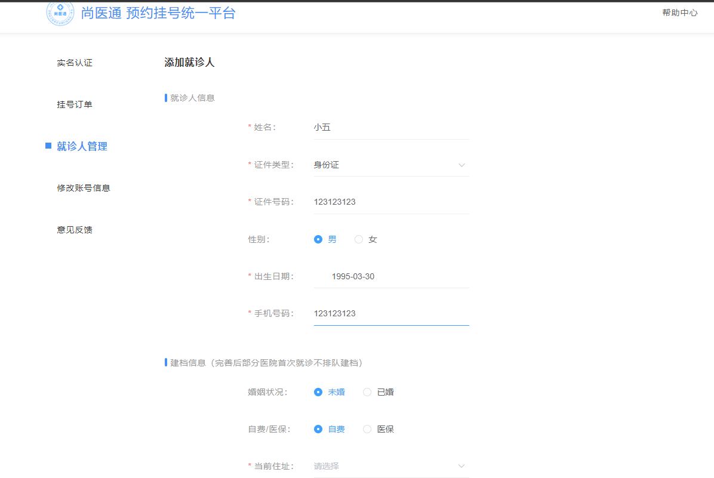

#### 回到科室页，找到`多发性硬化专科门诊`科室(仅此科室有数据)

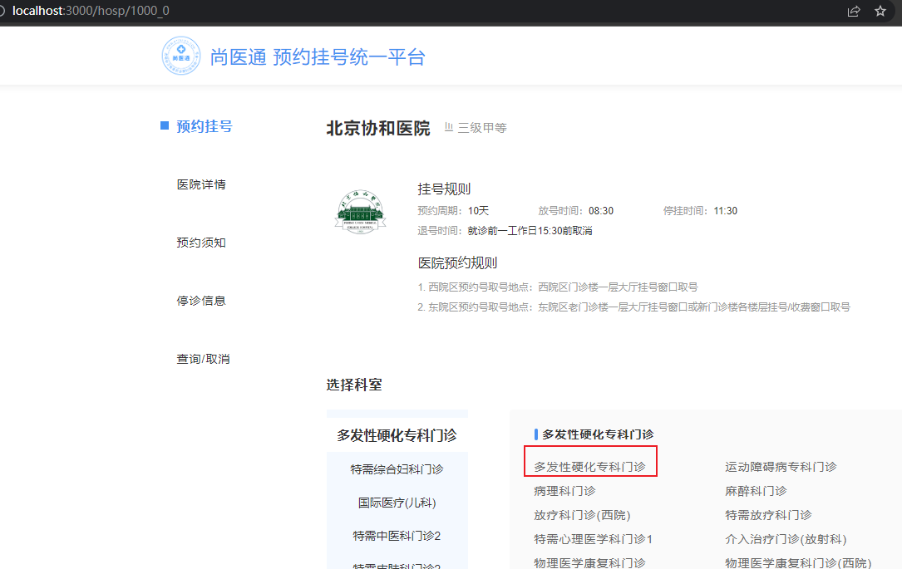

#### 进行挂号


#### 进行支付(目前3秒轮询查询订单状态, 待已支付后窗口关闭)


### 退单流程

#### 退单逻辑在`OrderService-cancelOrder, 可自行将时间限定注释打开`

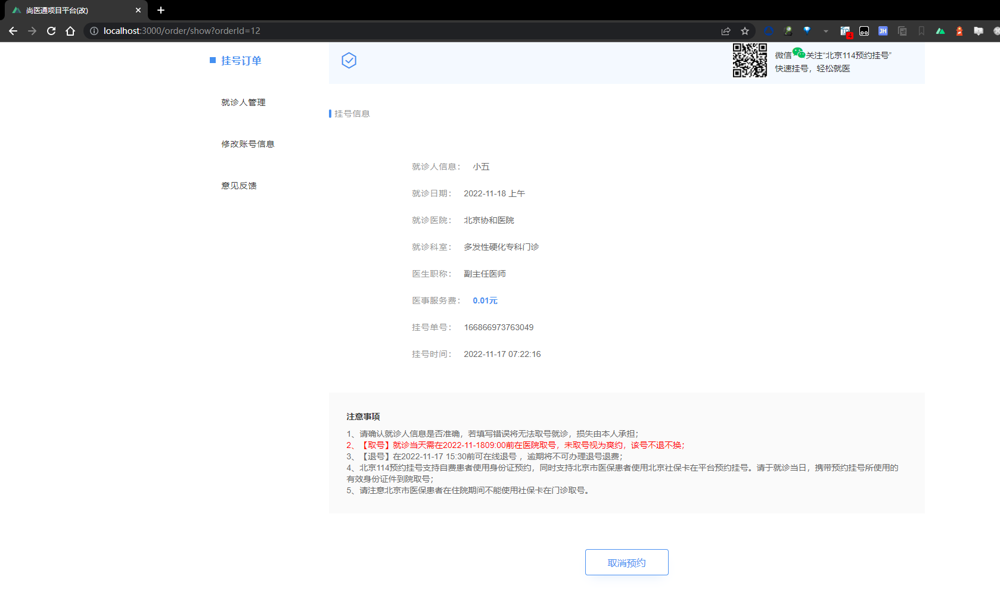

### spring boot admin查看各模块状态

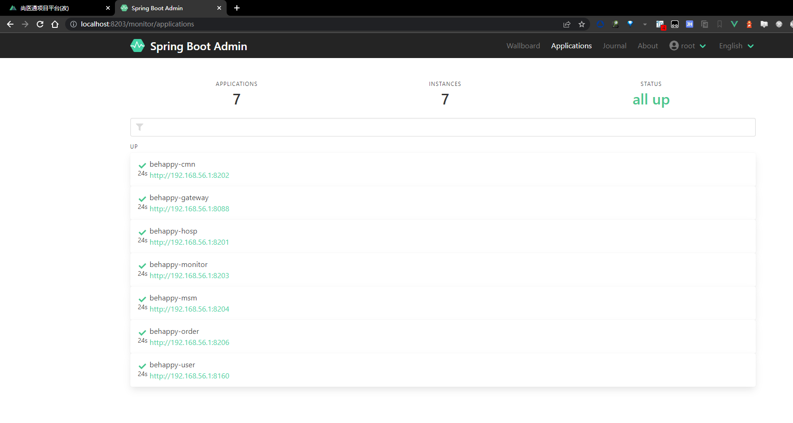

### xxl job (数据我已添加完，下面是演示)

#### 添加执行器（AppName必须和`xxl.job.executor.appname`保持一致）

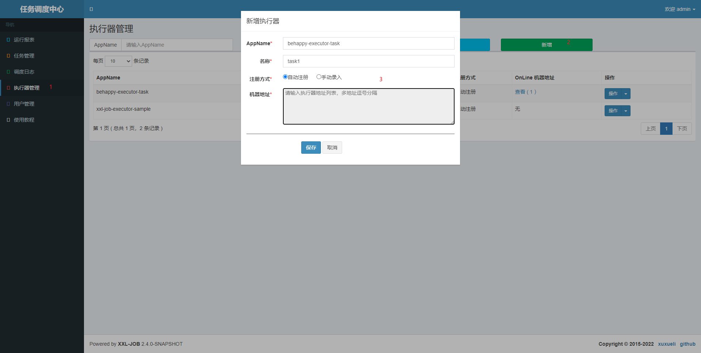

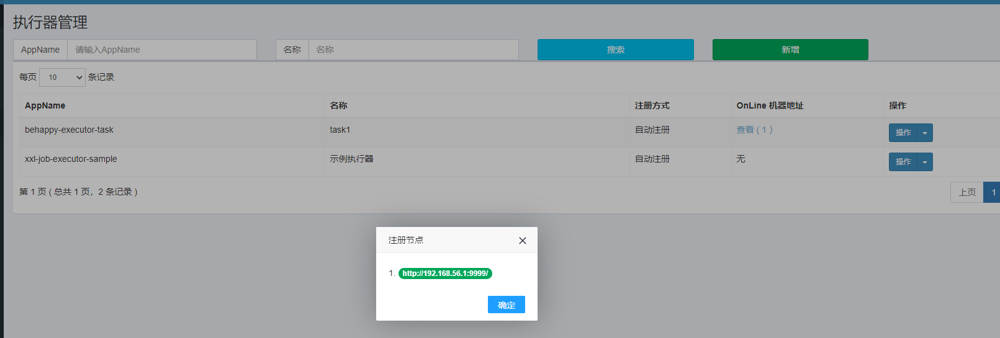

#### 添加任务(handler对应代码在`ReminderXxlJob`)

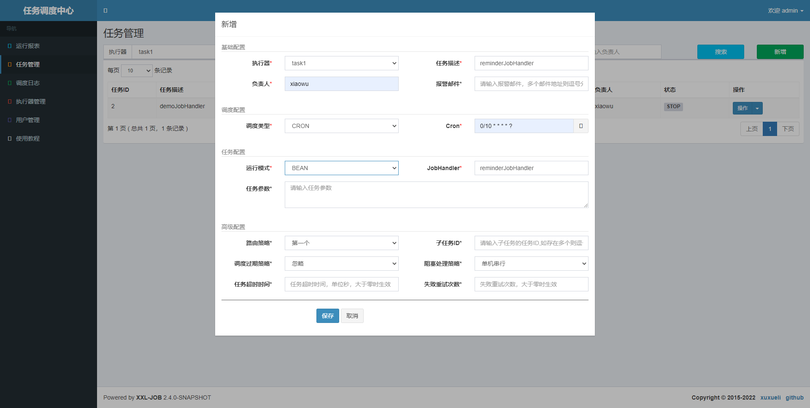

#### 执行日志查看

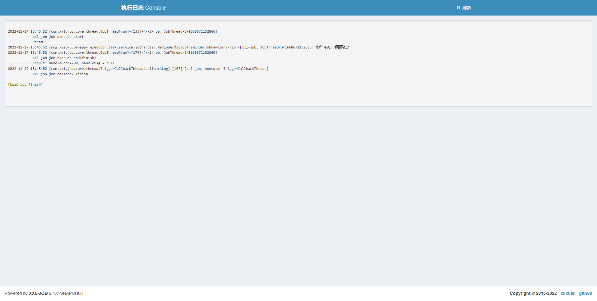

### 查看msm服务

> 接收到了mq的提醒消息

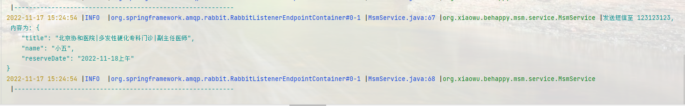

# 各服务地址一览

### behappy-hospital-user

地址：http://localhost:3000

### behappy-hospital-admin

地址：http://localhost:9528

### 医院接口模拟管理系统

地址：http://localhost:9998/

### Nacos控制台

地址：http://192.168.56.100:8848/nacos

账户：nacos

密码：nacos

### sentinel dashboard

地址：http://192.168.56.100:8858/

账户：sentinel

密码：sentinel

### druid控制台

地址：http://localhost:{服务端口}/druid/login.html

账户：admin

密码：admin

### spring doc地址

地址：http://localhost:8088/swagger-ui/index.html

### xxl job admin

地址：http://192.168.56.100:8080/xxl-job-admin/

账户：admin

密码：123456

### spring boot admin

地址：http://localhost:8203/

账户：root

密码：root

### canal manager

地址：http://192.168.56.100:8089/

账户：admin

密码：123456

### rabbitMQ manager

地址：http://192.168.56.100:15672/

账户：root

密码：root

# 模块

```
├─behappy-api --放feign和VO/DTO/Constant
│  ├─behappy-api-cmn
│  ├─behappy-api-common
│  ├─behappy-api-hosp
│  ├─behappy-api-manager
│  ├─behappy-api-msm
│  ├─behappy-api-order
│  └─behappy-api-user
├─behappy-cmn --数据字典模块
├─behappy-common --公共模块
│  ├─behappy-common-core --核心模块
│  ├─behappy-common-mongo --mongo模块
│  ├─behappy-common-mybatis --mybatis模块
│  ├─behappy-common-rmq --rabbit mq模块
│  └─behappy-common-sentinel --sentinel/feign配置模块
├─behappy-executor-task --放定时任务, 整合xxl-job使用
├─behappy-gateway --网关模块
├─behappy-hosp --医院模块
├─behappy-manager --后台管理模块
├─behappy-monitor --springboot admin
├─behappy-msm --短信模块
├─behappy-order --订单模块
├─behappy-oss --oss模块
├─behappy-statistics --信息统计模块
├─behappy-user --用户模块
└─doc
    ├─01-教案
    ├─02-分析图
    ├─03-尚医通架构图
    ├─04-尚医通业务流程图
    ├─05-sql
    └─nacos
```

