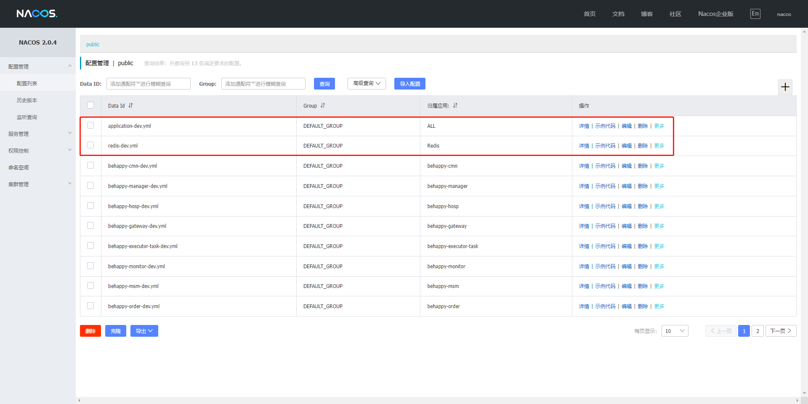
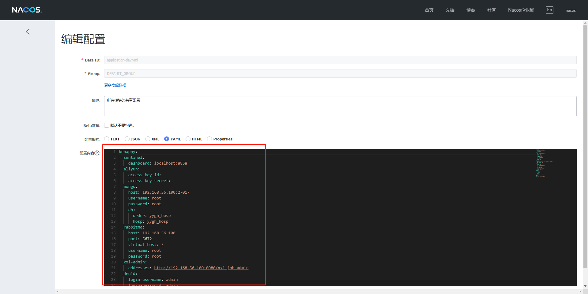

# behappy-hospital(尚医通-改)

> 所有文档/sql在doc目录下

### 介绍

- 背景

本项目是在尚硅谷-尚医通项目基础上改造， 整合分布式事务、 限流降级、 分布式定时任务， 监控等技术， 完善了业务代码， 修改了许多原项目存在的bug

- 目的

```
我很喜欢b站的一位up主`不高兴就喝水`, 他举过一个例子
我们平时在街头上来来往往会遇到很多人, 但回到家会发现对任何一个人都没有印象
但是如果漫雪纷飞的街头上, 你吃着关东煮, 被一6尺7寸的老大哥撞了下, 关东煮撒了, 签子把你的羽绒服戳穿了个大洞, 白雪皑皑, 让你分不清天上下的是雪还是绒毛
估计这一遭, 能让你对这老大哥记一辈子
所以我的目的, 就是想可以借着这个实战项目持续输出一些技术/代码能力, 以此加深/巩固自己对这些技术/代码能力的认识
```

### TODO
- [x] swagger3 -> springDoc open api
- [ ] seata业务整合 - 0%
- [ ] sentinel业务整合 - 70%

### 技术栈

alibaba,cloud,springboot,最佳实践版本:https://github.com/alibaba/spring-cloud-alibaba/wiki/%E7%89%88%E6%9C%AC%E8%AF%B4%E6%98%8E

**核心依赖**

> Jdk: 17
>
> Maven: 3.8.7
> 
> Nodejs: 10.24.1


| 依赖                   | 版本             |
|----------------------|----------------|
| Spring Boot          | 3.0.2          |
| Spring Cloud         | 2022.0.1       |
| Spring Cloud Alibaba | 2022.0.0.0-RC1 |
| Mybatis Plus         | 3.5.3.1        |
| Spring Doc Open Api  | 2.0.2          |
| Behappy-Redis        | 3.0.0          |
| Wxpay-Sdk            | 0.0.3          |
| Hutool               | 5.8.11         |
| Xxl job              | 2.3.1          |
| Druid                | 1.2.15         |
| Spring Boot Admin    | 3.0.0         |

### 配置

> 推荐使用`https://github.com/behappy-hospital/behappy-docker-application`仓库下的组件，版本以及配置是经我测试过的，仅需全局修改`192.168.56.100`为你的ip即可
> 
> 执行命令：git clone https://github.com/behappy-hospital/behappy-docker-application && cd behappy-docker-application && docker-compose -f mysql/docker-compose.yml up -d && docker-compose -f redis/docker-compose.yml up -d && docker-compose -f mongo/docker-compose.yml up -d && docker-compose -f rabbitmq/docker-compose.yaml up -d && docker-compose -f nacos/docker-compose.yml up -d && docker-compose -f sentinel/docker-compose.yml up -d && docker-compose -f xxl-job-admin/docker-compose.yml up -d
> 
> 使用nacos config作为配置中心和服务发现，先执行nacos初始化sql，导入doc/nacos目录下的zip，然后修改[bootstrap.yml]中的nacos地址和账户密码，以及nacos中的全局配置和redis配置，如下图





### 启动流程

0. clone[组件应用库](https://github.com/behappy-hospital/behappy-docker-application.git), 切到各自目录下执行`docker-compose up -d`

> 需要nacos,behappy-sentinel-dashboard,redis,rabbitmq,mongo,mysql

1. 执行`doc/sql`下的sql文件

2. 启动项目, 各模块作用已标明在文档中

**后端必须启动的模块**

```yaml
BehappyCmnApplication
BehappyGatewayApplication
BehappyHospApplication
BehappyManagerApplication
BehappyMsmApplication
BehappyOrderApplication
BehappyUserApplication
```

**前端模块**
> npm install
> 
> npm run dev/start

[behappy-hospital-user](https://github.com/behappy-hospital/behappy-hospital-user) -- 平台页面

[behappy-hospital-admin](https://github.com/behappy-hospital/behappy-hospital-admin) -- 后台管理

### 操作流程(项目启动成功后)

0. 登陆manager服务, 设置医院信息


1. 导入医院数据


2. 找到behappy-manager/resources下的department.json, 复制粘贴-科室列表


3. 找到behappy-manager/resources下的schedule.json, 复制粘贴-排班列表
4. 登陆behappy-hospital-user, 完成注册登陆

> **使用localhost访问,不要用ipv4,保证与微信回调地址一致**

- 使用手机号或者微信登陆(目前是模拟发送短信, 在MsmService中可自行打开注释. 微信登陆使用谷粒学院的key和secret)


- 登陆后会回调到`myheader.vue的loginCallback方法中`, 如果openid为空则说明此用户为新用户, 需要绑定手机号. 接着打开手机登录层，绑定手机号
- 查看Msm模块的日志, 能找到验证码

5. 完成实名验证

- 已取消了图片验证, 可以不传图片, 如果传图片, 记得将oss模块中的key和secret补全


- 登陆到admin, 通过认证


6. 下单流程

- 添加就诊人
- 找到`多发性硬化专科门诊`科室(仅此科室有数据)
- 进行挂号


- 进行支付(目前3秒轮询查询订单状态, 待已支付后窗口关闭)
  

7. 退单流程
   退单逻辑在`OrderService-cancelOrder, 可自行将时间限定注释打开`
   

8. springboot admin查看各模块状态(http://localhost:8203/ [账户密码: root@root])


9. xxl job: http://192.168.56.100:8080/

- 添加task


- 添加任务(handler对应代码在`ReminderXxlJob`)


> 执行日志查看


> msm服务也接收到了mq的提醒消息


### 模块

```yaml
├─behappy-api --放feign和VO/DTO
│  ├─behappy-api-cmn
│  ├─behappy-api-common
│  ├─behappy-api-hosp
│  ├─behappy-api-manager
│  ├─behappy-api-msm
│  ├─behappy-api-order
│  └─behappy-api-user
├─behappy-cmn --数据字典模块
├─behappy-common --公共模块
│  ├─behappy-common-core --核心模块
│  ├─behappy-common-mongo --mongo模块
│  ├─behappy-common-mybatis --mybatis模块
│  ├─behappy-common-rmq --rabbit mq模块
│  └─behappy-common-sentinel --sentinel/feign配置模块
├─behappy-executor-task --放定时任务, 整合xxl-job使用
├─behappy-gateway --网关模块[swagger地址](http://localhost:8088/swagger-ui/index.html)
├─behappy-hosp --医院模块
├─behappy-manager --后台管理模块
├─behappy-monitor --springboot admin
├─behappy-msm --短信模块
├─behappy-order --订单模块
├─behappy-oss --oss模块
├─behappy-statistics --信息统计模块
├─behappy-user --用户模块
└─doc
    ├─01-教案
    ├─02-分析图
    ├─03-尚医通架构图
    ├─04-尚医通业务流程图
    └─05-sql
```
